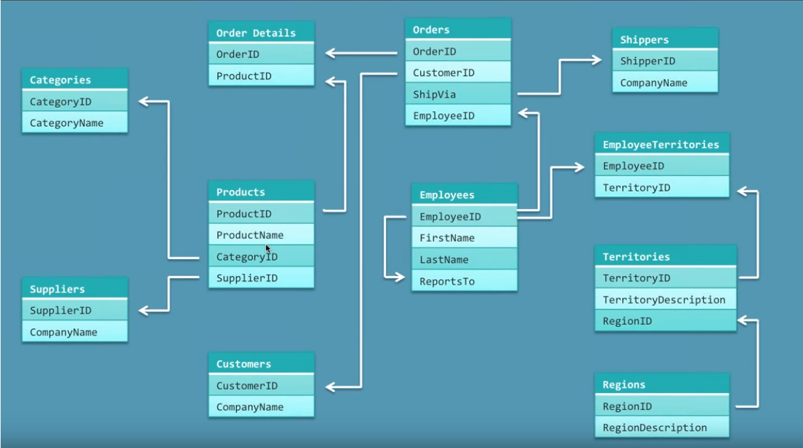

```{r setup, include=FALSE}
knitr::opts_chunk$set(echo = TRUE)
```
<style>
.codeArea {
    display: block;
    padding: 9.5px;
    margin: 0 0 10px;
    font-size: 13px;
    line-height: 1.42857143;
    color: #333;
    word-break: break-all;
    word-wrap: break-word;
    background-color: #f5f5f5;
    border: 1px solid #ccc;
    /*border-radius: 4px;*/
    border-left: 10px solid lightgray !important;
}
</style>


I will be using the famous Microsoft database Northwind as my relational database to show my case for migrating MySQL rational database to noSQL database, which in my case will be Neo4j. 

So, we will start with this schema stricted database where the entities are related:


to a noSQL database, in my case it's graph database with nodes and their relations.


I started by downloading the sql dump for the NorthWind database found on the internet, and then run it locally on MySQL to generate the schema and create the database NorthWind in MySQL.

The sql script I used is stored in my github repository found here:
https://github.com/theoracley/Data607/blob/master/NoSQLMigration/Northwind.MySQL5.sql

This is my NorthWind database created locally in MySQL:


## Export the rational database tables into csv files

While there is an ETL tool in Neo4j that can import a rational database into Neo4j, I will not use it. Rather, I prefer to export the tables to CSV files and then import them in Neo4j using the Load_CSV Neo4j command, so I can understand how everything works.

In MySQL, by right clicking on each table and choose to export the table to csv, I was able to create few CSVs.
In this case, I choose to export the following tables only: Categories, Customers, Order Details, Orders, Products and Suppliers.

## Enter Neo4j

I loaded Neo4j (Community Edition) and created a Graph (aka Database). I then needed to upload my CSV files to the import directory of the Neo4j installation, so I don't have to mention the whole path of the csv file in the cypher command.

The following cypher commands were entered in Neo4j to create the NorthWind Graph database:

<div class="codeArea">

// Create Constraints<br>
CREATE CONSTRAINT ON (p:Product) ASSERT p.productID IS UNIQUE;<br>
CREATE CONSTRAINT ON (c:Category) ASSERT c.categoryID IS UNIQUE;<br>
CREATE CONSTRAINT ON (s:Supplier) ASSERT s.supplierID IS UNIQUE;<br>
CREATE CONSTRAINT ON (c:Customer) ASSERT c.customerID IS UNIQUE;<br>
CREATE CONSTRAINT ON (o:Order) ASSERT o.orderID IS UNIQUE;<br>
 
// Create Indexes<br>
CREATE INDEX ON :Product(productName);<br>
CREATE INDEX ON :Category(categoryName);<br>
CREATE INDEX ON :Supplier(companyName);<br>
CREATE INDEX ON :Supplier(contactName);<br>
CREATE INDEX ON :Supplier(city);<br>
CREATE INDEX ON :Supplier(country);<br>
CREATE INDEX ON :Supplier(postalCode);<br>
CREATE INDEX ON :Customer(companyName);<br>
CREATE INDEX ON :Customer(contactName);<br>
CREATE INDEX ON :Customer(city);<br>
CREATE INDEX ON :Customer(country);<br>
CREATE INDEX ON :Customer(postalCode);<br>
CREATE INDEX ON :Order(customerID);<br>
CREATE INDEX ON :Order(shipName);<br>
CREATE INDEX ON :Order(shipCity);<br>
CREATE INDEX ON :Order(shipCountry);<br>
CREATE INDEX ON :Order(shipPostalCode);<br>
 
// Load Products<br>
LOAD CSV WITH HEADERS FROM "file:///Products.csv" AS row<br>
CREATE (n:Product)<br>
SET n = row,<br>
  n.unitPrice = toFloat(row.unitPrice),<br>
  n.unitsInStock = toInt(row.unitsInStock), n.unitsOnOrder = toInt(row.unitsOnOrder),<br>
  n.reorderLevel = toInt(row.reorderLevel), n.discontinued = (toInt(row.discontinued) <> 0);<br>
 
// Load Categories<br>
LOAD CSV WITH HEADERS FROM "file:///Categories.csv" AS row<br>
CREATE (n:Category)<br>
SET n = row;<br>
 
// Load Suppliers<br>
LOAD CSV WITH HEADERS FROM "file:///Suppliers.csv" AS row<br>
CREATE (n:Supplier)<br>
SET n = row;<br>
 
// Create Product to Category Relationships<br>
MATCH (p:Product),(c:Category)<br>
WHERE p.categoryID = c.categoryID<br>
CREATE (p)-[:PART_OF]->(c);<br>
 
// Create Product to Supplier Relationships<br>
MATCH (p:Product),(s:Supplier)<br>
WHERE p.supplierID = s.supplierID<br>
CREATE (s)-[:SUPPLIES]->(p);<br>
 
// Load Customers<br>
LOAD CSV WITH HEADERS FROM "file:///Customers.csv" AS row<br>
CREATE (n:Customer)<br>
SET n = row;<br>
 
// Load Orders<br>
LOAD CSV WITH HEADERS FROM "file:///Orders.csv" AS row<br>
CREATE (n:Order)<br>
SET n = row;<br>
 
// Create Customer to Order Relationships<br>
MATCH (c:Customer),(o:Order)<br>
WHERE c.customerID = o.customerI<br>D
CREATE (c)-[:PURCHASED]->(o);<br>
 
// Load Order Details<br>
LOAD CSV WITH HEADERS FROM "file:///OrderDetails.csv" AS row<br>
MATCH (p:Product), (o:Order)<br>
WHERE p.productID = row.productID AND o.orderID = row.orderID<br>
CREATE (o)-[details:ORDERS]->(p)<br>
SET details = row,<br>
  details.quantity = toInt(row.quantity);<br>

</div>

## Querying the NorthWind Graph with Cypher
 
we now ask the Neo4j NorthWind graph database to return the nodes it has.Notice how different types of nodes are colored differently to reflet each node type. We use the Cypher query language to query the graph database.


## Using R to interact with Neo4j

In our case, we use Neo4r driver to allow R to interact with Neo4j to query the database. let' see how it works.


``` {r }
#install.packages("neo4r")
library(neo4r) #R packgae for Neo4j
# library(igraph)
#library(dplyr)

#create a connection to my local Neo4j database
con <- neo4j_api$new(
  url = "http://localhost:7474", 
  user = "neo4j", 
  password = "Malek@1234"
)

# Test the endpoint with the ping, and investigate the response status. 200 = connection is up
con$ping()
```

``` {r }
# return all nodes of type Category
res <- 'MATCH (n:Category) RETURN n' %>%
  call_neo4j(con, type = "graph") # %>%
  # extract_relationships() %>%
  # unnest_relationships()

unnest_nodes(res$nodes)
```

## Conclusion

There you have it. I went from knowing nothing about Neo4j, to become more familiar with it and understanding and almost mastering graph databases and the Cypher query language. This is why I did note choose another noSQL DB like MongoDB or something else. I wanted to really understand Graph databases and through this assignment I achieve that.

So we use noSQL database instead of rational databases to stay free from the restriction of the schema in the rational DBs. Rational Databases require lot of computing for executing queries due to relational references. Rational databases cannot or impossible to scale horisontally. Vertical scaling is also limited.
With noSQL databases, no schema is enforced. Instead of rows, they store documents and documents can be with different structures. No schema is enforced. No schema implies no relations. Relations are not used heavily if needed. Parents can have childs within it, so does not need to reference child records outside it, which make any referencial queries very fast.
